# StudyPhobia

 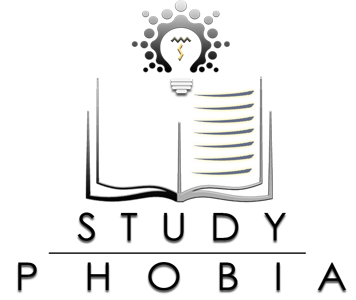

StudyPhobia is a E-Learning  website with a interactive ,responsive & good looking UI made of Bootstap Framework in front end & Php Codignither Framework in The Backend.

## TECHNOLOGY USED
* Php
* Codignither
* MySql
* Bootstrap
* Html 5
* CSS

## USER INTERFACE

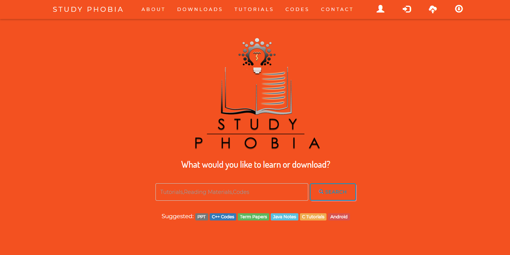

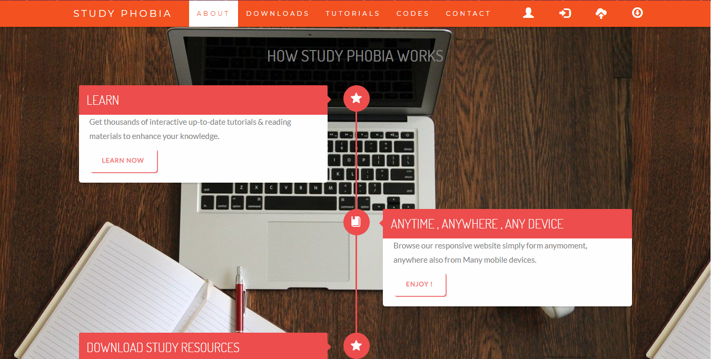

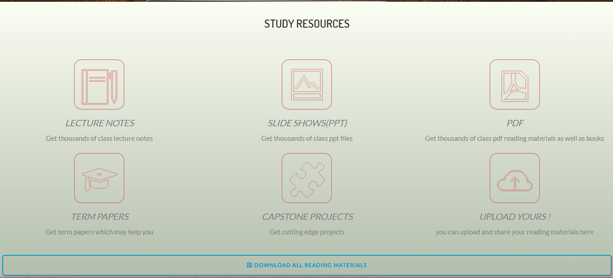

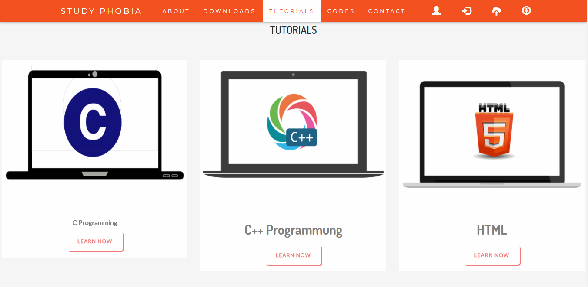

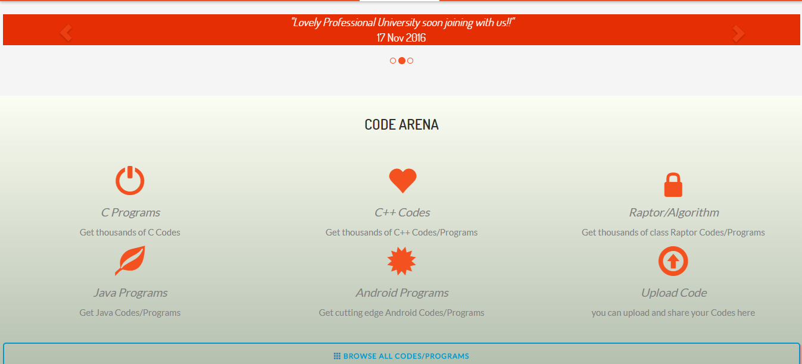

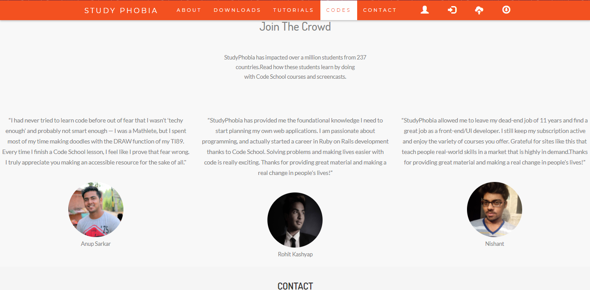

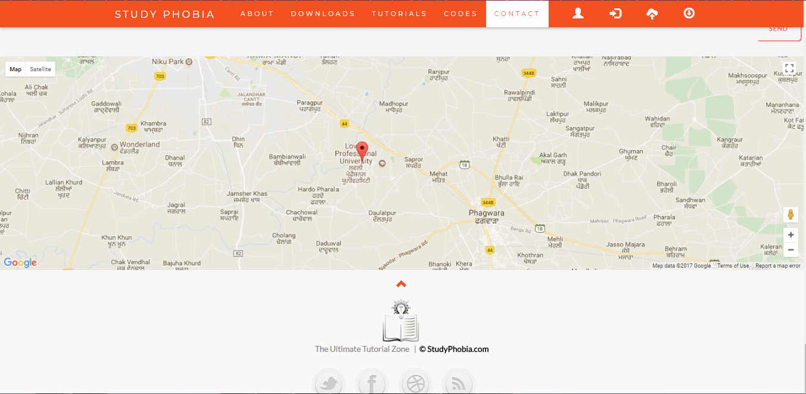

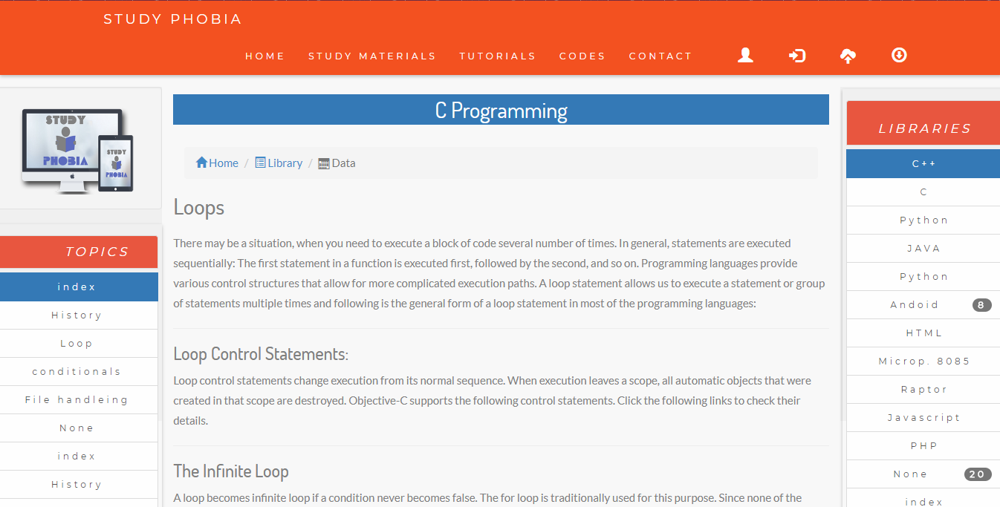

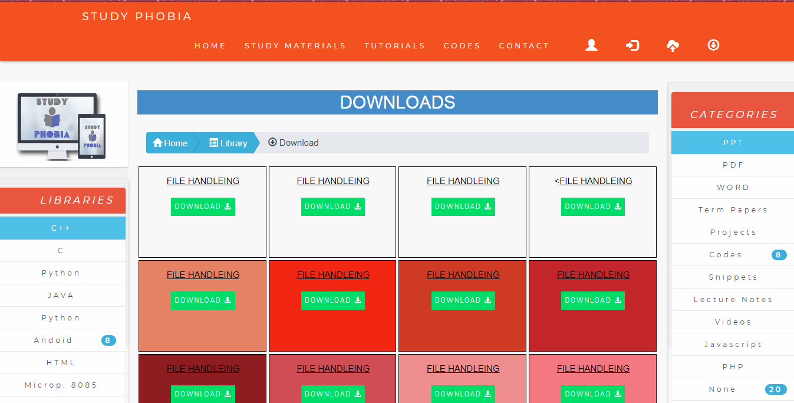

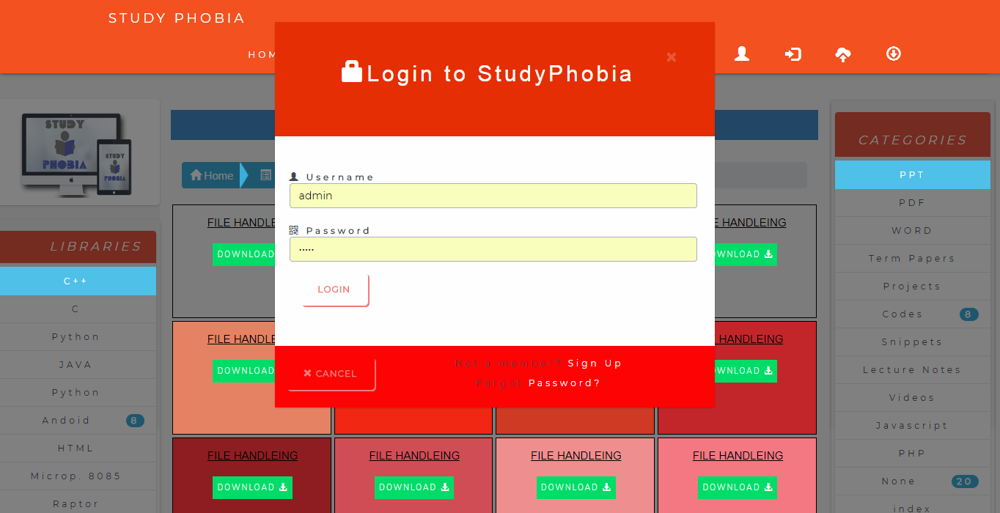

